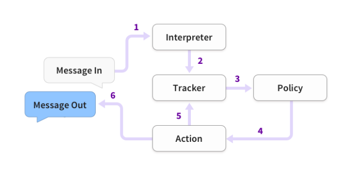
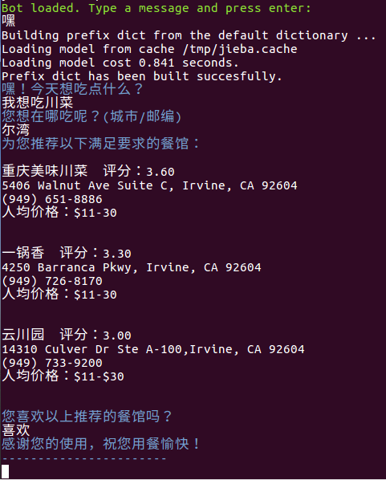
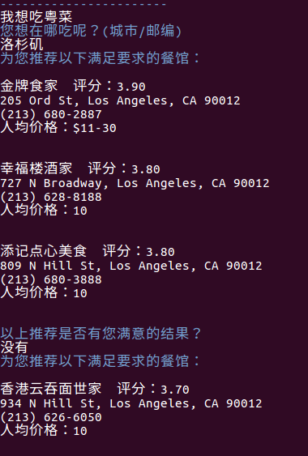
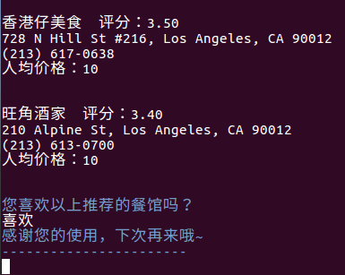

# Restaurant Recommending Chatbot

## Content

1. Main Purpose
2. Chatbot Architecture
3. Dependency
4. Simple Training Data Samples
5. Demostration
6. To Do

## Main Purpose

This Chatbot aims at recommending restaurants according to the interactions with users. Chatbot will first gather enough information from users and then make recommendations.

More precisely, by now, Chatbot will first ask for the location of users (or by calling api of some platforms) and preferred flavors, and then talk to the database to make recommendations based on ratings of restaurants.

After some recommendations are made, Chatbot will start to listen for feedbacks from users. If the users are not satisfied with the current recommendations, Chatbot will continue recommending to users until they are satisfied or all related results have been recommended.

All actions of Chatbot is determined by machine learning instead of concrete rules (i.e. lots of if else statements), which means the Chatbot is very robust and easy to expand and maintain even if the Chatbot becomes very large and sophisticated.

## Chatbot Architecture

The backend of Chatbot can be divided into two parts:  
**Rasa NLU, Rasa Core**

- Message In: Users speak to Chatbot, Chatbot gets input.

- Interpreter: The NLU part. Parse users' input and extract structured data (intent and entities) from it. After finishing parsing, pass the structured data to Rasa Core.

- Tracker: A component of Rasa Core, which is used to track the state of the conversation with users. Tracker gets the structured date from NLU part, and then change the current conversation state.

- Policy: A component of Rasa Core, which determines the actions Chatbot should take. It gets the current state and structured data from tracker and determines the next action.

- Action: After the next action is determined by Policy, the action is performed by Rasa Core and sent to Tracker to change the conversation state.

- Message Out: After the action is performed, a response message will be sent to users and listen for the next input from users.

## Dependency

- Natural Language Processing: Rasa NLU
- Conversation Contral: Rasa Core
- Sentence Segement: jieba
- [total_word_feature_extractor_chi.dat](https://pan.baidu.com/s/1kNENvlHLYWZIddmtWJ7Pdg) Password: p4vx  
(or you can train your own one)
- Database: MySQL

## Simple Training Data Samples

### Rasa NLU Training Data

    {
        "rasa_nlu_data": {
            "common_examples": [
                {
                    "text": "有什么推荐的川菜馆",
                    "intent": "search",
                    "entities": [
                    {
                        "start": 6,
                        "end": 8,
                        "value": "川菜",
                        "entity": "flavor"
                    }
                    ]
                },
                {
                    "text": "推荐几个烧烤店",
                    "intent": "search",
                    "entities": [
                    {
                        "start": 4,
                        "end": 6,
                        "value": "烧烤",
                        "entity": "flavor"
                    }
                    ]
                }
            ]
        }
    }

All NLU training data can be found in: nlu/data/examples/rasa/nlu_data_food_handwrite.json

### Rasa Core Training Data

    ## get info and search
        * greet
            - utter_greet
        * search
            - utter_ask_flavor
        * provide_flavor{"flavor": "川菜"}
            - slot{"flavor": "川菜"}
            - utter_ask_location
        * provide_location{"location": "Irvine"}
            - slot{"location": "Irvine"}
            - action_search_restaurants
        > search_finished

    ## return results
        > search_finished
            - slot{"results": [["香港云吞面世家", "3.70", "934 N Hill St, Los Angeles, CA 90012", "(213) 626-6050", "10"]]}
            - utter_goodornot
        * deny
            - action_more_results
            - slot{"results": []}
            - utter_bye
            - action_restart

All Rasa Core training data can be found in: core/data/stories.md

## Demostration

1. First, start Rasa NLU service. Run the following command in nlu directory.

        python3 -m rasa_nlu.server -c sample_configs/config_jieba_mitie_sklearn.json

2. To train the dialog model, run the following command in core directory.

        python3 -m rasa_core.train -s data/stories.md -d domain.yml -o models/dialogue --epochs 300

3. To start the Chatbot program, run the following command in core directory.

        python3 -m rasa_core.run -d models/dialogue -u ../nlu/models/default/current

Here are some images showing the Chatbot execution.  
After all information is collected, Chatbot start to make recommendations until users are satisfied. Only 3 recommendations are returned each time for user friendly purpose.

To try all features, please git clone and run it on your local machine.

## To Do

This project is not finished yet. There are still many aspects can be improved. Here is some work I will do in the future.

- Write a frontend for it or connect it to some platforms.
- Record the choices users make every time to improve the recommend method.
- Automatically update restaurant database at regular intervals.

